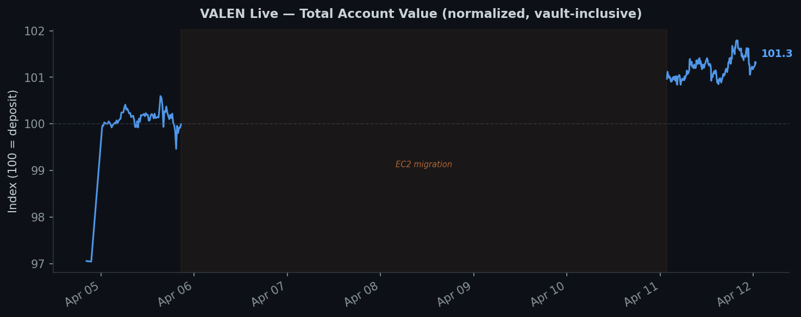
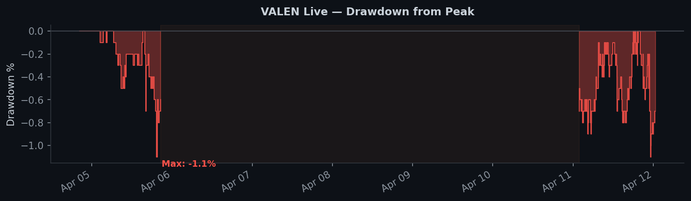
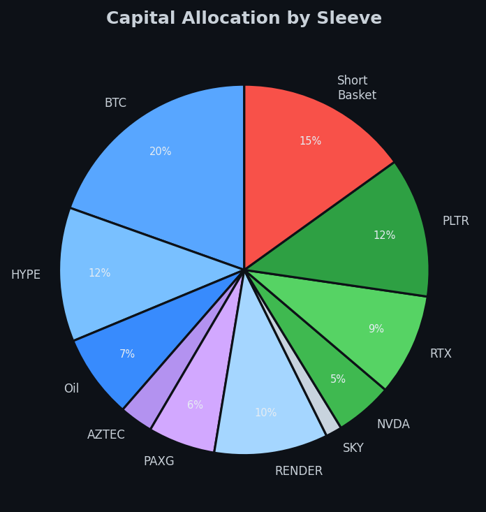

# Live Performance

VALEN went live on Hyperliquid mainnet on **April 4, 2026**. This page reports real, unredacted operational metrics from the production system. Absolute dollar amounts are normalized to protect account size.

**This is early-live data.** Presenting it honestly is the point — too many portfolio projects show only backtests, and too many live-trading projects quietly curate their numbers. The April 4-10 period includes an EC2 migration outage. The April 17 spike shows the aftermath of the vol-drift staleness fix (capital deployment recovered from 17.8% to 95% — see [PROBLEMS_SOLVED.md](PROBLEMS_SOLVED.md#1-the-stale-vol-drift-bug)). Showing these messy inflections is deliberate.

---

## Current Status (April 19, 2026)

| Metric | Value |
|--------|-------|
| Days live | 15 (with one 5-day migration outage) |
| Sleeves active | 11 / 11 (5 currently carrying positions post-fix) |
| Capital deployment | ~95% (post-vol-drift fix, up from 17.8% pre-fix) |
| Max drawdown (from peak) | ~1.1% (occurred during initial sizing, day 2) |
| Health check interval | ~5 minutes |
| Circuit breaker trips | 0 |
| API budget utilization | 0 / 960 per minute |

## Equity (Normalized)



- Index 100 = initial deposit
- 5-day gap (Apr 6-10) was an EC2 migration — system was offline for infrastructure hardening, not due to a loss event
- Current index: **101.3** (account is in profit)

## Drawdown



- Max drawdown: **1.1%** (occurred during initial position sizing on day 2)
- Post-migration drawdown consistently below 1%
- The shallow drawdown profile reflects 0.69x gross leverage — deliberately conservative for the first live month

## Capital Allocation



The 11-sleeve portfolio spans crypto (BTC, HYPE, RENDER, AZTEC, SKY, PAXG), TradFi builder perps (NVDA, RTX, PLTR), commodities (Oil), and a 30-coin inverse-vol-weighted short basket.

## What the Logs Show

From the live orchestrator log (`valen_live.log`):

```
=== HEALTH === up=0.2h eq=$22,778 DD=0.7% mem=98.8MB api=0/960
  SLV btc        running eq=$3,338 pos=FLAT evals=240
  SLV hype       running eq=$1,998 pos=long evals=227
  SLV oil        running eq=$1,252 pos=FLAT evals=243
  SLV nvda       running eq=$860   pos=long evals=225
  SLV rtx        running eq=$1,520 pos=long evals=227
  SLV sleeve_c   running eq=$2,574 pos=short evals=249
GROSS_LEVERAGE | 0.69x | hype=$9,377 nvda=$2,437 rtx=$1,448 short=$2,574
```

Every 5 minutes, the system logs: equity per sleeve, drawdown, memory usage, API budget, and position state. Each sleeve independently evaluates signals, applies the economics gate (edge vs. cost), and reports back to the orchestrator.

## The Economics Gate

The system's economics gate blocks trades where edge-to-cost ratio is below 1.3x. This is by design — the system prefers sitting flat to paying fees on marginal signals. From the logs:

```
ECONOMICS_GATE | btc | edge_z=0.043 cost_z=0.043 ratio=1.0 < min=1.3
ECONOMICS_GATE | oil | edge_z=-0.415 cost_z=0.060 ratio=-6.9 < min=1.3
```

BTC has a valid long signal but the edge barely covers costs. Oil has negative edge — the system correctly refuses to trade it.

In the early-live period, gross leverage hovered around 0.69x. Some of that was correct behavior (economics gate declining marginal edges). A portion of it, we later discovered, was the vol-drift staleness bug — six sleeves were frozen at 0.5-1.6x leverage floors by stale overrides, not by legitimate economics. Post-fix (April 17), the deployment recovered to 95% of equity with clean economics — five active long targets plus the hedge sleeve on signal.

The takeaway: **low deployment can mean correctly cautious or silently broken.** Distinguishing between those two requires per-sleeve forensic analysis, not a dashboard alert.

## What's Not Shown

- Absolute dollar amounts (normalized to index 100)
- Signal parameters, EMA periods, thresholds
- Exact scoring formulas for the short basket
- Per-asset calibration values
- Wallet addresses or API keys

These are withheld to protect the system's edge, not to hide poor performance.
